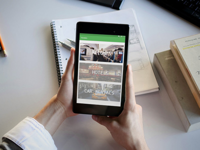

# Travelers
A booking application that allows users to book for flights, car rentals, and hotels.

Created by [Harsh Patel](https://github.com/hpatel-cs "Harsh Patel"), [Jennifer Tran](https://github.com/jennifertran "Jennifer Tran"), [Enosh Anwar](https://github.com/EnoshAnwar "Enosh Anwar"), [Zhikan Xu](https://github.com/Jason-xu96 "Zhikan Xu"), and [Huizi Hao](https://github.com/hhz2014 "Huizi Hao").

## Features

- List the prices of flights from lowest to highest or vice versa
- Book for multiple people for the same flight
- Pay directly within the application
- Emails purchase verification once process has been complete

## Development Process

As a group, we often use slack to communicate our thoughts and ideas as well as having group meetings whether it be in person or on skype.

We developed the application within 3 iterations where in each iteration we prioritize the key features and distribute developer tasks among team members to create a minimum viable product.

For the structure of our application, we used a 3-tier architecture which includes business logic, presentation, and persistence (database).

## Reflection
From the technical side of the project, we realized that implementing the entire booking system for the hotels and car rentals was out of our scope given the limited amount of time we have from the previous iteration. Therefore as a group we decided to focus on only implementing the flight booking system entirely.

The flight list wasn’t as aesthetically pleasing as we wanted to since we originally wanted the user to be able to see more information about a particular flight from the flight list by clicking on it. We also took note that the flight list doesn't have as much sorting functionality as it should have and the database of our project wasn’t well utilized.

If we were to do this project again we should have focused more on utilizing the available API's out there and as well the structure our application to where we can add more features without wasting a lot of the developer time. 

## How to Run the Application
1. Requires Google Nexus 7 (1200 x 1920), Android 6.0.0, API 23
2. Select the App in Run/Debug Configuation
3. Wait for the build to finish then run the application